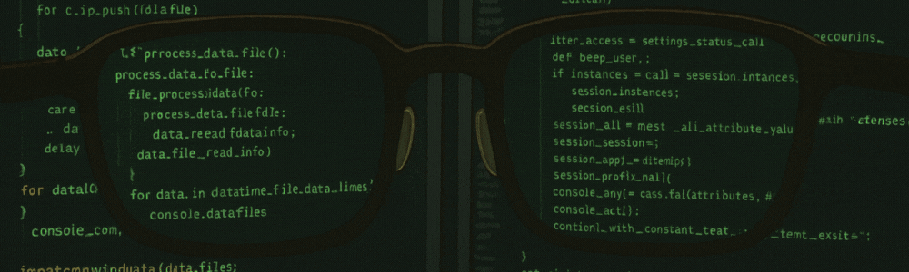

</p>
    
</p>

## 💻 About Me
I'm a Systems Analysis and Development student at IFSP (Federal Institute of São Paulo). Passionate about programming, process automation, data analysis, and web development. I love creating elegant solutions through code and am constantly working on engaging projects that combine functionality with aesthetic appeal. My goal is to contribute to innovative solutions while continuously expanding my technical expertise.

## 🛠 Technologies & Tools


## 📈 GitHub Stats

<div align="center">
  
  
</div>

## ⏱ My Coding Time
<!--START_SECTION:waka-->

```text
From: 27 April 2025 - To: 04 May 2025

Total Time: 10 mins

Python   10 mins         ████████████████████████▒   96.72 %
C        0 secs          ▓░░░░░░░░░░░░░░░░░░░░░░░░   03.28 %
```

<!--END_SECTION:waka-->


## 🐍 Contributions
<p align="center">
  
</p>


## 💼 LinkedIn
<a href="https://www.linkedin.com/in/wmendesc/" target="_blank">
  
</a>

## 🏆 GitHub Trophies
[](https://github.com/ryo-ma/github-profile-trophy)
