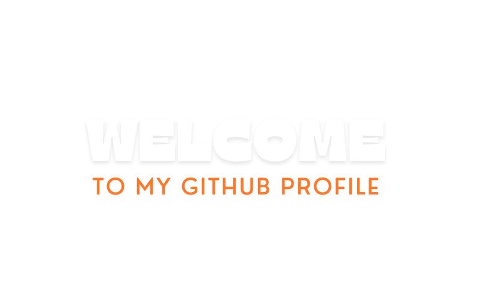

    

## 🚀 Sobre mim
Sou estudante de Análise e Desenvolvimento de Sistemas no IFSP. Tenho interesse em Python, automações, dados e aplicações web. Estou sempre buscando aprender mais e compartilhar meus projetos.

## 🛠️ Tecnologias & Ferramentas

## 📊 Estatísticas do GitHub

  
  

## 🐍 Contribuições

## Linkedin

## 🏆 Troféus do GitHub

